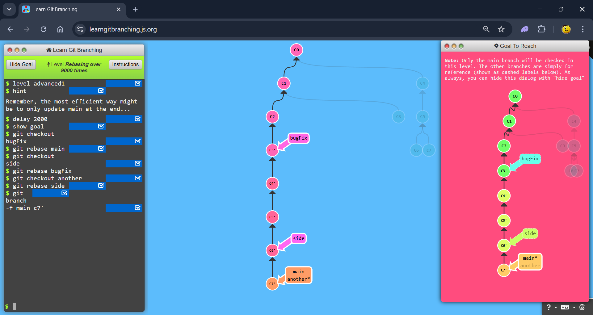
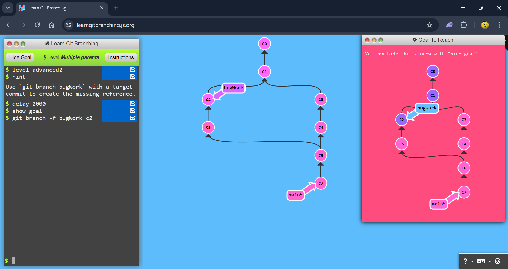
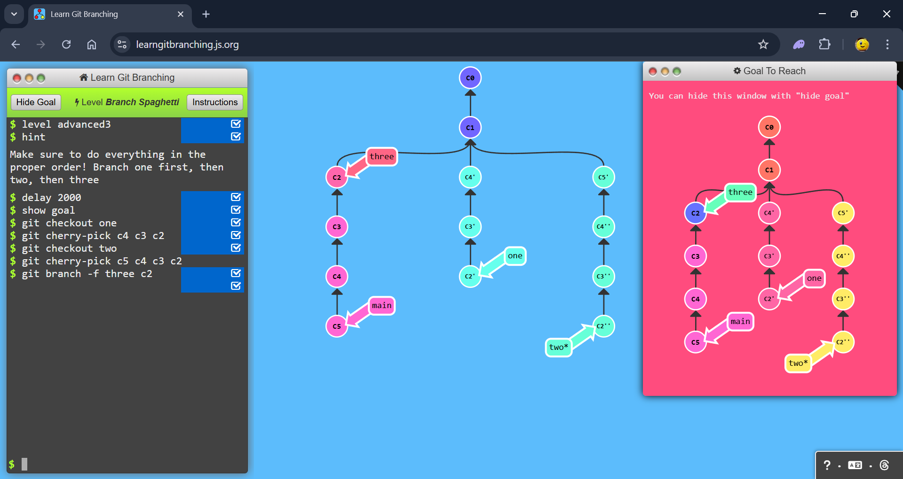

# level 5 - Advanced Topics

## 1: Rebasing over 9000 times

### Commands

```
git checkout bugFix
git rebase main
git checkout side
git rebase bugFix
git checkout another
git rebase side
git branch -f main c7'
```



## 2: Multiple parents

### Commands

```
git branch -f bugWork c2
```



## 3: Spaghetti

### Commands

```
git checkout one
git cherry-pick c4 c3 c2
git checkout two
git cherry-pick c5 c4 c3 c2
git branch -f three c2
```


