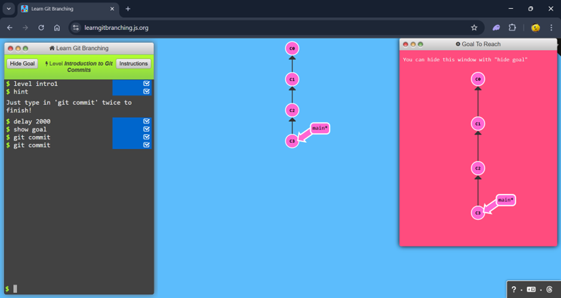
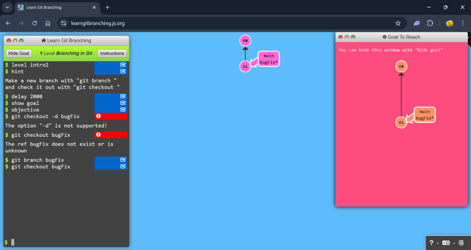
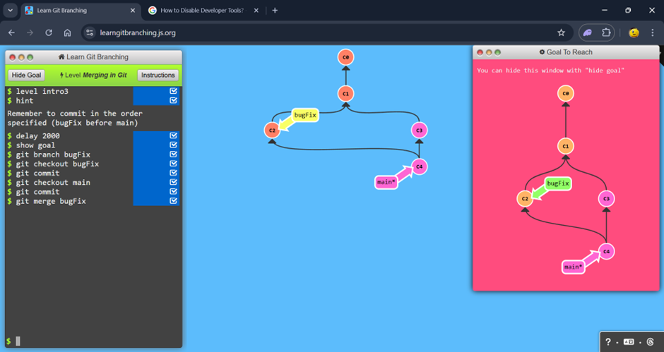
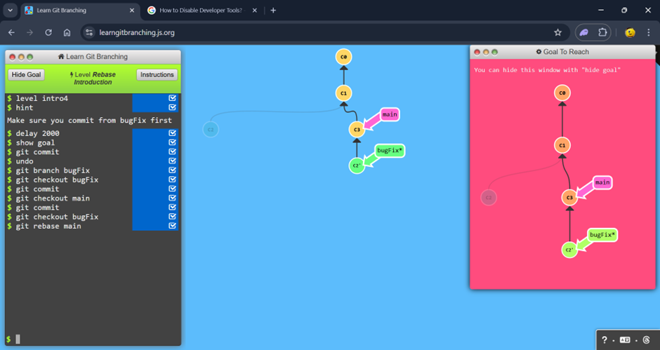

# level intro1

## 1: Introduction to Git Commits

### Commands

```
git commit
git commit
```



## 2: Branching in Git

### Commands

```
git branch bugFix
git checkout bugFix
```



## 3: Merging in Git

### Commands

```
git branch bugFix
git checkout bugFix
git commit
git checkout main
git commit
git merge bugFix
```



## 4: Rebase Introduction

### Commands

```
git branch bugFix
git checkout bugFix
git commit
git checkout main
git commit
git checkout bugFix
git rebase main
```


