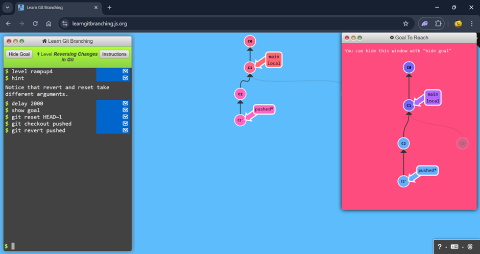
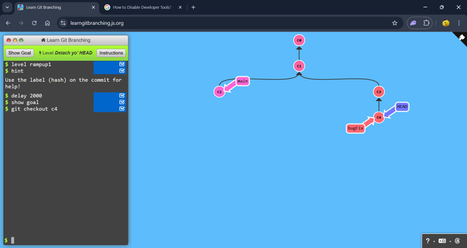
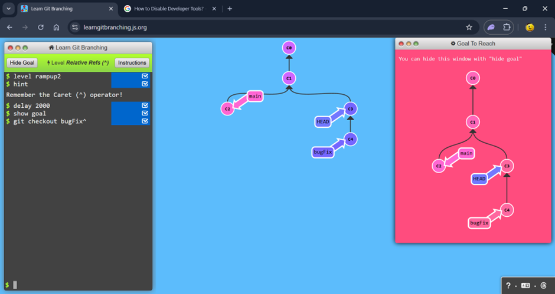

# level 2

## 1: Detach yo' HEAD

### steps

$ show goal

$ git checkout c4

## 2: Relative Refs (^)

### steps

$ show goal

$ git checkout bugFix^

## 3: Relative Refs #2 (~)

### steps

$ git branch -f main c6

$ git checkout HEAD^1

$ git bbranch -f bugFix HEAD~1

$ git branch -f bugFix HEAD~1

## 4: Reversing Changes in Git

### steps

$ git reset HEAD^1

$ git checkout pushed

$ git revert pushed

