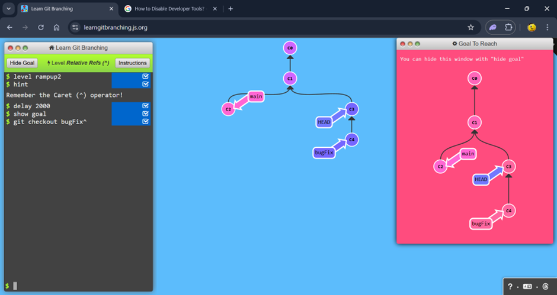

# Ramping Up

## 1: Detach yo' HEAD

### Commands

```
show goal

git checkout c4
```


## 2: Relative Refs (^)

### Commands

```
show goal

git checkout bugFix^
```



## 3: Relative Refs #2 (~)

### Commands

```
git branch -f main c6

git checkout HEAD^1

git bbranch -f bugFix HEAD~1

git branch -f bugFix HEAD~1
```


## 4: Reversing Changes in Git

### Commands

```
git reset HEAD^1

git checkout pushed

git revert pushed
```


